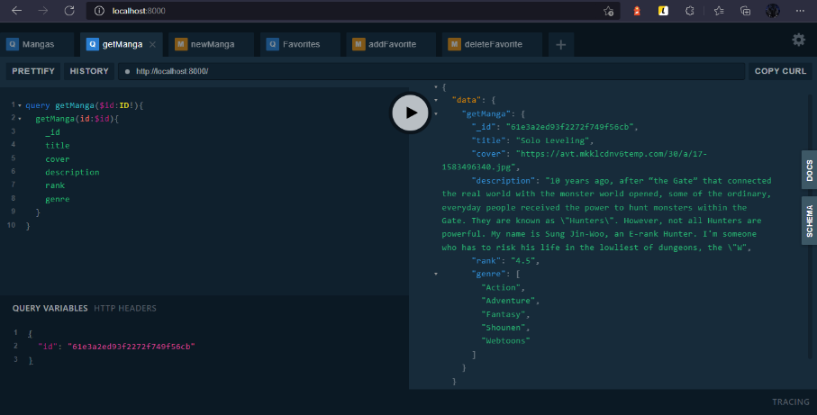

# Ariadne-python-graphql version 2

Este proyecto fue desarrollado  con [Ariadne](https://ariadnegraphql.org/) y [Graphql](https://graphql.org/learn/) conectandose a [MongoDB](https://www.mongodb.com/atlas/database).

# Proposito del proyecto
Los fines del proyecto  son para el aprendizaje  desarrollar una api de Graphql  con python en este
caso con Ariadne  de la cual no hay muchos proyectos con ella espero y te sea de ayuda desarrolador 
que estas clonando este repo no solo copies trate de entender como  funcina la aplicacion.


# Mejoras respecto a lo anterior 
Se ha restructurado la estructura de carpetas siguiendo el patrón MVC. Se ha agregado  [mongoengine](https://docs.mongoengine.org/index.html) para conectar con mongodb se agregó el archivo __init__.py a las carpetas para que se consideren como paquetes y no modulos.por último se ha actualizado Ariadne a su última versión para poder dividir las mutaciones y resolvers en sus carpetas correspondientes haciendo uso de los decoradores. 

# Descripción de la aplicación 
Aplicación para registrar mangas y animes también se pueden agregar como favoritos y se puede consultar un manga o anime de forma individual o en conjunto ya sea por favoritos o generos  en caso de los animes se pueden previsualizar las secuelas y precuelas del mismo. 

# Estructura de carpertas 
La aplicación contiene las siguientes carpetas `assets` donde se guardan las imagenes que se utilizan en este documento. La carpeta `src` donde se guarda todo el codigo de la aplicación  fuera de las carpetas tenemos las siguientes archivos.

-  <span style="color:#7397F0;font-weight: bold">.gitignore:</span> Archivos o carpetas igonorados para el repositorio de git.

- <span style="color:#7397F0;font-weight: bold">requirements.txt :</span> Contine las dependencias de python a instalar.

- <span style="color:#7397F0;font-weight: bold"> app.py :</span> El punto de arranque de la aplicación contine la configuración inicial de Ariadne.

dentro de la carpeta src encontramos:

- <span style="color:#7397F0;font-weight: bold"> config :</span> La carpeta config contiene todas las configuraciones de mongodb mongoengine asi como los modelos de la aplicación.

-  <span style="color:#7397F0;font-weight: bold">controllers :</span> Contine todas las funciones para interactuar con la base de datos.

-  <span style="color:#7397F0;font-weight: bold">definitions:</span> Contiene todas las funciones  relacionadas  graphql.

dentro de la caperta definitions encontramos:

- <span style="color:#7397F0;font-weight: bold">error:</span> Paquete que contine el manejo de errores de graphql

- <span style="color:#7397F0;font-weight: bold"> mutations:</span> Paquete que contiene  las funciones para las mutaciones de graphql

- <span style="color:#7397F0;font-weight: bold"> resolvers:</span> Paquete que contiene las funciones para los queries de graphql


# Schema de Graphql
El Schema es lo que define la forma en la que tu aplicación va a trabajar con graphql principalmente se  
compone de querys y mutaciones, aunque también puedes agregar tipos estarás familiarizados con ellos si has trabajado con interfaces en typescript o estructuras en golang. 

 

## Tipos de datos para la aplicacion
Para esta aplicación solo se necesitan los tipos Anime y Manga ya que son las estructuras de datos que 
definen esta aplicación. Graphql también nos permite tener `interfaces` las cuales funcionan como un contrato especificando que tipo de datos pueden contener nuestros tipos al igual que typescript para implementar la interfaz en el tipo de dato hacemos uso de la palabra reservada `implements`. 

```graphql
  interface Struct{
      _id:ID
      title:String!
      cover:String!
      description:String!
      type:String!
      genre:[String!]!
      rank:String!
      favorite:Boolean!
      chapters:Int!
  }

  type Anime implements Struct{
      _id:ID
      title:String!
      cover:String!
      description:String!
      type:String!
      genre:[String!]!
      rank:String!
      favorite:Boolean!
      chapters:Int!
      sequel:[Anime!]!
      prequels:[Anime!]!
  }

  type Manga implements Struct{
      _id:ID
      title:String!
      cover:String!
      description:String!
      type:String!
      genre:[String!]!
      rank:String!
      favorite:Boolean!
      chapters:Int!  
  }

```
## Querys para consultas 
Los querys se usan principalmente para definir las consultas que se pueden realizar a tu fuente de datos.

```graphql
 type Query{
    Animes:[Anime!]!
    getAnime(id:ID!):Anime!
    Mangas:[Manga!]!
    getManga(id:ID!):Manga!
    Favsanime:[Anime!]!
    Favsmanga:[Manga!]!
    Genreanime(genre:String!):[Anime!]!
    Genremanga(genre:String!):[Manga!]!
}
```
En este caso `Animes` y `Mangas` nos darán como resultado una lista de animes o mangas , para poder obtener uno solo registro utilizamos `getManga`o `getAnime` como se puede ver las querys pueden recibir parámetros de entrada en este caso `(id:ID!)` con esto le estamos indicado a la query que va a recibir un parámetro de tipo `ID`. Por último tenemos las querys ` Favsanime`y` Favsmanga` que nos retornaran como resultado una lista de animes o mangas que estén como favoritos e igual con `Genreanime` y ` Genremanga` reciben como parámetro un string y nos retornara una lista de animes o manga de acuerdo al género que se busque. 

 

## Mutaciones para escritura
Las mutaciones en graphql se utilizan para modificar, agregar o actualizar los datos de la fuente de datos con la que estemos trabajando.

```graphql
  type Mutation {
    newAnime(anime: NewAnimeInput!):String!
    newManga(manga:NewMangaInput!):String!
    addFavorite(id:ID!,classi:Classification):String!
    deleteFavorite(id:ID!,classi:Classification):String!
      
  }
```
Se puede opbservar en el codigo anterior que las mutaciones se declaran de una forma muy parecida a las querys tambien pueden resevir parametros. Graphql nos permite definir un tipo para  definir la entrada en una mutacion por ejemplo ` NewAnimeInput!`. La input son defenciones  de como queremos recibir los parametros esto nos ayuda al momento de usar el playground detectar erres al momento de pasar parametros los datos de este tipo se declaran con la palabra reservada `input`.

```graphql
  input NewAnimeInput{
      title:String!
      cover:String!
      description:String!
      genre:[String!]!
      rank:String!
      chapters:Int!
      sequel:[String!]!
      prequels:[String!]!
      favorite:Boolean
  }

  input NewMangaInput{
      title:String!
      cover:String!
      description:String!
      genre:[String!]!
      rank:String!
      chapters:Int!
  }


```
## Enums en graphql
Tambien podemos utilizar [enums](https://techterms.com/definition/enum) en graphql si observamos el codigo  de Mutaciones podemos ver las funciones `addFavorite` y ` deleteFavorite` reciben dos parametros  un parametro `!ID` y un parametro `classi:Classification` este parametro  es definido mediante un enum.

```graphql
  enum Classification{
      ANIME
      MANGA
  }

```
los enums nos permite definir un conjunto de constantes  cuyo valor no va a cambiar en este caso cuando el usuario  quiera agregar un nuevo favorito  en el parametro `classi:Classification` solo podra seleccionar los valores de `ANIME` o `MANGA` declarado en el enum. 


# Observaciones y Mejoras a implementar
En el schema podemos observar que cada tipo por ejemplo `ID!` tienen un `!` este operador le dice a graphql que ese dato no puede ser nullish o null tiene que devolver algun dato. Tanto favoritos como buscar por genero se podrian traer como un Union type o un inline fragment queda pendiente para una proxima version ver si ariadne puede implmentarlo ya que su documentacion no es muy clara de como trabajar con ellos.


# Manejador de errores de grapql
Graphql es  detallado al momento de producir errores ya que nos puede mostrar donde localizar mucho mas facil el error. sin embargo en producion  no se recomeinda dejar esta opcion habilitada  para eso aridne nos proporciona la opcion de escribir un manejador de errores para mas detalle te invito a leer este articulo de la documentacion de Ariadne sobre ello [Error Messaging](https://ariadnegraphql.org/docs/error-messaging).


# Virtual environment

Crea un entorno virtual utilizando virtualenv o conda y luego ejecuta el comando ` pip install -r requirements.txt` o ` pip3 install -r requirements.txt ` para instalar las dependencias. 


# Run Graphql playground

Ejecuta  el comando ` uvicorn app:app ` recuerda estar en el directorio donde esta tu app.py o el punto
de entrada de tu aplicación. visita `http://localhost:8000`.


